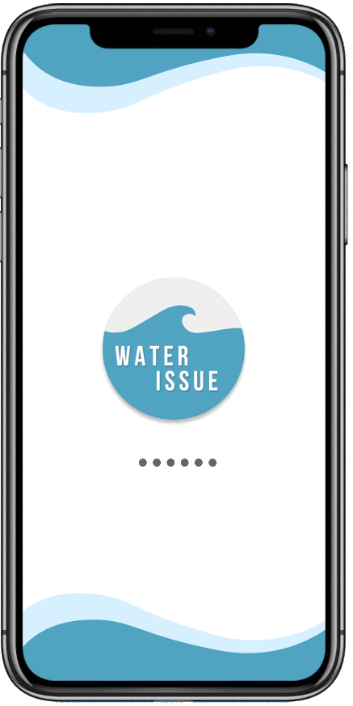
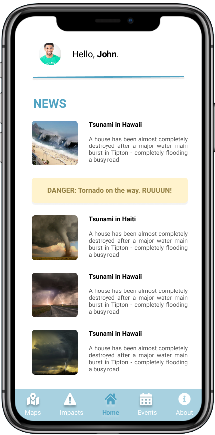
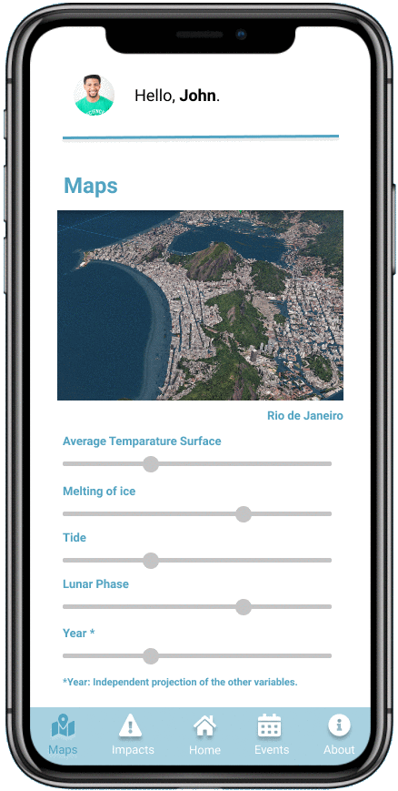

# NASA Space Apps Challenge 2019
  Software developed for NASA Hackathon, as part of the challenge proposed in
  2019.

### About

The company challenged the participants with a lot of project options in many different knowledge areas, and everyone should choose only one.

My group identified a bit more with the "Earth's Oceans" category, and then developed an application in "Rising Water" section.

Our solution is a mobile app that communicates users \(local population\) about the impacts of rising oceans in the world \(and in their own lives\), showing them these changes graphically. The program is capable of realizing simulations, as well as alerting people if a disaster is on the way. All of this is only possible because data is being received in real-time from monitoring platforms \(NASA Databases and others\).

Users have the following variables available to predict future situations:

* Sea Surface Temperature
* Melting of ice
* Tide
* Lunas Phase
* Year \(projection under statistical data\)

### Product Info

* **Page:** nasa.matheuslino.com.br
* **Mockup** \(main screens\):
  * 

### Instructions

* **Mockup:** All images are located in **Mockup folder**.
* **Site:** the entire product page source code is located in the **Site folder**. You can download it and import it into your personal project if you want.
* **Google drive:** other files used in the project, such as NASA data \(analysis and technical information crossing\), inspiring things, etc, are located in the follow URL:
  * [bit.ly/nasa-challenge-2019](http://bit.ly/nasa-challenge-2019)

### Team

* Matheus A. Lino \(author\)
* Levi Augusto Campos Lima
* Milena Vitoria de Oliveira
* Uryan Natal Suman
* Vinícius Edson Silva Santos

### Version

> Release: `1.0.0`

### License

MIT License

